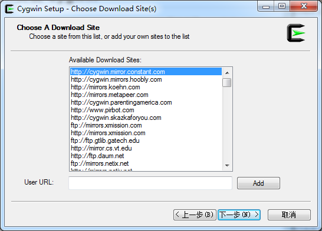
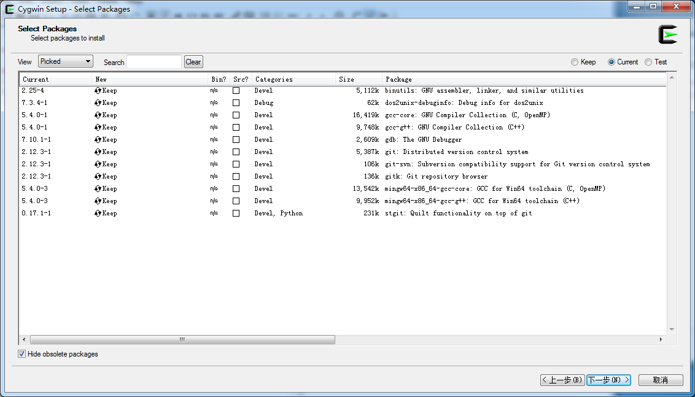

# Cygwin with git for windows

从 unbuntu 转到 windows，git 使用中文出现各种乱码问题，而且 ubuntu 上面的一些命令也无法沿用。 出于上面两个考虑，我使用 Cygwin 来执行 git 命令。
## 1.安装 Cygwin
1. 下载 https://cygwin.com/install.html （上面提供了32/64位的  Cygwin 按需下载)。
2. 安装过程中会出现这个窗口，随便选一个就行了，我用的第一个：
3. 下面是所需要安装的一下库，最快找到这些软件的方法是选择“Category”，然后搜索所需要的库，然后在 Devel Default 分类中找。
4. 可以运行 cygcheck -c cygwin 来检测是否安装成功。 

## 2.通过右键直接在当前目录下打开 Cygwin
1. 第一步：修改windows注册表
 + 开始->运行(或者win键+R)，输入REGEDIT，回车，打开注册表编辑器；
 + 找到HKEY_CLASSES_ROOT\Directory\Background\shell；
 + 右键点击shell，“新建”->“项”，名字是要显示在右键菜单中的，可以随便写。这里写“OpenCygwin”，回车；
 + 在刚创建的“OpenCygwin”上点右键，新建->项，这回名字不能乱起，写“command”，回车。右边窗口会显示一个名字叫“默认”，类型为“REG_SZ”的键值；
 + 双击那个“默认”，能够修改数值数据，里面输入Cygwin的启动脚本路径，比如我的“D:\Dev\Cygwin\Cygwin.bat %V”，把引号去掉，写好确定，**请注意最后的 %V。**
 + OK，现在在文件夹中点开右键，你就可以看到多了一个名字叫“OpenCygwin”的选项。别急着点，肯定会提示错误，继续下一步。
 

2. 第二步：修改Cygwin启动脚本和环境变量
 + 修改 Cygwin.bat 文件，如下：
```html
@echo off  
set _T=%* #关键在这里加这句  
D:  
chdir D:\Dev\Cygwin\bin  
  
bash --login -i  
```
 + 修改 .bash_profile 文件，在 home\\(用户名)目录下，文件最后加入： 
```html
export _T=${_T//\\//}   # replace backslash to fowardslash  
if [[ $_T == "" ]]; then  
    export _T="c:/Users/Administrator"  
fi  
```


3. 如果此时能够右键在当前目录下打开 Cygwin 那么就恭喜你。若出现说 “.bash_profile 未预期的文件结尾”，则要用 dos2unix 转换下该文件的格式，继续往下看。

## 3. 使用 dos2unix 转换文件格式
由于 windows 和 linux 的回车符不同，当你使用 windows 上的文本编辑器打开 .bash_profile 时，回车符被格式化了，就导致一场。下面教你采用 dos2unix 将文件格式转换回来：
1. 下载 dos2unix
2. 将下载下来的 dos2unix.exe 拷贝到 C:\Windows\System32 的根目录下即可使用 dos2unix 命令
3. 运行 dos2unix -n .bash_profile .bash_profile 即可将文件转换回来（我直接使用 dos2unix .bash_profile 也可以）

这样就大功告成了。

## 4. 设置 Cygwin 的默认目录
1. 打开 Cygwin 的 .bashrc (一般 git 安装完成后会在 C:\用户\用户名 里创建 .bashrc 文件，但 Cygwin 是在自己的安装目录下的 \home\username里，譬如我的就是 D:\git\home\zhangruofan）
2. 在最后一行添加： cd <默认目录>。譬如我的就是 cd D:\projects\meizu\GameCenter
3. 双击桌面上行的 Cygwin 图标打开看是否自动定位到自己设置的目录中

**注意**：如果出现 “bash: $'\r': 未找到命令” 异常的话，还是和上面一样，要转换下格式： dos2unix .bashrc 即可。

## 5. 配置 Meld
Meld 安装完成后，在 user 目录中（Cygwin 是在安装目录里，我的是 D:\cygwin\home\username）创建 .gitconfig 文件（windows 中创建该文件，文件名应该写 **.gitconfig.** (注意最后还要加一个点），然后加入以下内容：
```html
[diff]
	tool = meld
[difftool "meld"]
	path = d:/software/melddiff/Meld.exe
	keepBackup = false
	trustExitCode = false
	cmd = d:/software/melddiff/Meld.exe \"$(cygpath -w \"$LOCAL\")\" \"$(cygpath -w \"$REMOTE\")\"
[difftool]
	prompt = false

```
**注意**：path 为 meld.exe 所在的绝对路径，路径中的“/”不要用“\”。
